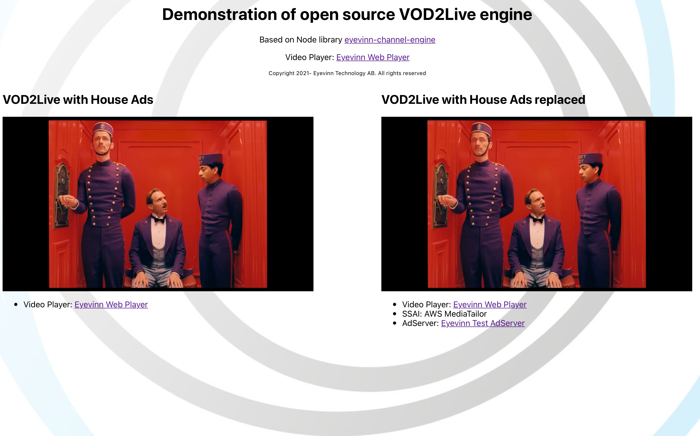
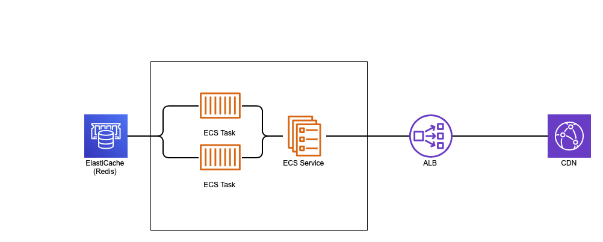

The Eyevinn Channel Engine is an NPM library that provides the functionality to generate "fake" live HLS stream by stitching HLS VOD's together. The library is provided as open source and this repository includes a basic reference implementation as a guide on how the library can be used.



Live demo here: [https://vod2live.eyevinn.technology](https://vod2live.eyevinn.technology)

## Usage

To use this library in your NodeJS project download and install the library in your project by running the following in your project folder.

```
$ npm install --save eyevinn-channel-engine
```

To run the basic reference implementation included in this repository you run:

```
$ npm start
```

To run the basic reference implementation for using demuxed VODs you run:

```
$ npm run start-demux
```

And to run the basic reference implementation for using live-mixing you run:

```
$ npm run start-livemix
```


Then point your HLS video player to `http://localhost:8000/channels/1/master.m3u8` to start playing the linear live stream.

## Master manifest filtering

The engine supports a very simplistic and basic filtering of media playlists included in the master manifest. Currently supports to filter on video bandwidth and video height. To specify a filter provide the query parameter `filter` when loading the master manifest, e.g. `(type=="video"ANDheight>200)AND(type=="video"ANDheight<400)`. This needs to be URL encoded resulting in the following URL: `http://localhost:8000/channels/1/master.m3u8?filter=%28type%3D%3D%22video%22ANDheight%3E200%29AND%28type%3D%3D%22video%22ANDheight%3C400%29`.

To filter by video bandwidth use the `systemBitrate` keyword in the query, e.g. `(type=="video"ANDsystemBitrate>2121000)AND(type=="video"ANDsystemBitrate<6161000)`.

You can also combine the filter conditions, e.g. `(type=="video"ANDheight>240)AND(type=="video"ANDsystemBitrate<4141000)`

## API

Initiate and start the engine as below.

```
const ChannelEngine = require('eyevinn-channel-engine');

const engine = new ChannelEngine(myAssetManager, { channelManager: myChannelManager });
engine.start();
engine.listen(process.env.port || 8000);
```

where `myAssetManager` and `myChannelManager` are classes implementing the interfaces below.

```
class MyAssetManager {
  getNextVod({ sessionId, category, playlistId }) -> { id, title, uri, offset, timedMetadata? }
  handleError(err, vodResponse)
}

class MyChannelManager {
  getChannels() -> [ { id, name, slate?, closedCaptions?, profile?, audioTracks?, options? } ]
}
```

Find a simplistic reference implementation for guidance in `./server.js`.


### Enabling Demuxed Audio
**LIMITATIONS:** At the moment, only supported for assets with matching audio track GROUP-IDs. Assets with different GROUP-IDs on their tracks will not be loaded correctly when transitioning between them, resulting in buffer errors. (This will be fixed).

To support playing assets with multiple audio tracks, a list of supported languages needs to be pre-defined. 
Assign to the `audioTracks` property,
in the return object for the channel manager class's `getChannels()` function, a list of objects in the following format

```
{
  language: { type: string } ,
  name:  { type: string },
  default: { type: bool } // optional
}
```
Example value for `audioTracks`:
``` 
audioTracks = [ { language: "en", name: "English", default: true }, { language: "es", name: "Español" } ];
```
**NOTE:** In the case where an asset does not have a track in a language found in the pre-defined list, then the asset's default track will be played in its place.

Find a simplistic reference implementation for guidance about using demuxed VODs in `./server-demux.js`.


### Options

Available options when constructing the Channel Engine object are:

- `defaultSlateUri`: URI to an HLS VOD that can be inserted when a VOD for some reason cannot be loaded.
- `slateRepetitions`: Number of times the slate should be repeated.
- `redisUrl`: A Redis DB URL for storing states that can be shared between nodes.
- `sharedStoreCacheTTL`: How long should data be cached in memory before writing to shared store. Default is 1000 ms.
- `heartbeat`: Path for heartbeat requests
- `channelManager`: A reference to a channel manager object.
- `streamSwitchManager`: A reference to a stream switch manager object.
- `cacheTTL`: Sets the cache-control header TTL. Default is 4 sec.
- `playheadDiffThreshold`: Sets the threshold when starting to adjust tick interval to compensate for playhead drift.
- `maxTickInterval`: The maximum interval for playhead tick interval. Default is 10000 ms.
- `cloudWatchMetrics`: Output CloudWatch JSON metrics on console log. Default is false.
- `useDemuxedAudio`: Enable playing VODs with multiple audio tracks. Default is false.
- `alwaysNewSegments`: Force all new HLS media sequences to always contain at least 1 new segment. Default is false.

## High Availability

As the engine is not a stateless microservice accomplish high availablity and redundancy is not a trivial task, and requires a shared cache cluster (also redundant) to store current state.



High availability support is from v3 general available in the Channel Engine and it uses Redis as the shared storage. This allows you to run a replicaset behind a round-robin load balancer as examplified in the drawing above. To enable high-availability initiate the engine with the URL to the Redis cache.

```
const engineOptions = {
  heartbeat: '/',
  averageSegmentDuration: 2000,
  channelManager: refChannelManager,
  defaultSlateUri: "https://maitv-vod.lab.eyevinn.technology/slate-consuo.mp4/master.m3u8",
  slateRepetitions: 10,
  redisUrl: "redis://127.0.0.1",
};

const engine = new ChannelEngine(refAssetManager, engineOptions);
engine.start();
engine.listen(process.env.port || 8000);
```


## Live Mixing (BETA)

This feature gives the possibility to mix in a true live stream in a Channel Engine powered linear channel (VOD2Live).

A beta-version of live-mixing with high availability support is available in the Channel Engine. This allows you to use a new component which can let you break in to a scheduled VOD event or Live stream event at any speficied time on top of the usual vod-to-live content. 
To enable live-mixing, create a class which implements the following interface.

```
class MyStreamSwitchManager {
  getSchedule(channelId) -> [ { eventId, assetId, title, type, start_time, end_time, uri, duration } ]
}
```
When using **Live Mixing** in **High-Availablilty** mode, it is important to know that the class's  `getSchedule(channelId)` function will be called by each channel-engine instance. Meaning that it is crucial that the implementation of this function will return the same response for each and every channel-engine instance, as they are expecting to be recieving identical lists in order to be synced up for live mixing. 

The class's `getSchedule(channelId)` function should return a promise containing the list of events as an object in the following format below:

```
{
  "eventId": {
      "type": "string",
      "description": "Generated ID of the event"
  },
  "assetId": {
    "type": "string",
    "description": "The ID of the asset in the schedule event"
  },
  "title": {
    "type": "string",
    "description": "Title of the asset"
  },
  "type": {
    "type": "number",
    "description": "Type of event (1=LIVE and 2=VOD)"
  },
  "start_time": {
    "type": "number",
    "description": "UTC Start time of the event as a Unix Timestamp (in milliseconds)"
  },
  "end_time": {
    "type": "number",
    "description": "UTC End time of the event as a Unix Timestamp (in milliseconds)"
  },
  "uri": {
    "type": "string",
    "description": "The URI to the VOD asset or Live Stream"
  },
  "duration": {
    "type": "number",
    "description": "The duration of the asset (in milliseconds) NOTE: Not required for Live Stream events"
  }
}
```

Below are examples of a Live stream event and a VOD event respectively:
```
{
  eventId: "eeecd5ce-d2d2-48db-b1b3-233957f7d69e",
  assetId: "live-asset-4",
  title: "My scheduled Live stream event",
  type: 1,
  start_time: 1631003900000,
  end_time: 1631003921000,
  uri: "https://cph-p2p-msl.akamaized.net/hls/live/2000341/test/master.m3u8",
}
```
```
{
  eventId: "26453eea-0ac2-4b89-a87a-73d369920874",
  assetId: "vod-asset-13",
  title: "My scheduled VOD event",
  type: 2,
  start_time: 1631004100000,
  end_time: 1631004121000,
  uri: "https://maitv-vod.lab.eyevinn.technology/VINN.mp4/master.m3u8",
  duration: 2 * 60 * 1000,
}
```
(*Important Note: When it comes to VOD events. Desired `duration` has priority over `end_time`. Meaning that you will only resume VOD2Live content after the asset in the VOD event has finished. This may change in the future.*) 


Then create an instance of the class and reference it as the `streamSwitchManager` in your engineOptions, just like you'd do with the channel manager. 

```
const MyStreamSwitchManager = new MyStreamSwitchManager();

const engineOptions = {
  heartbeat: '/',
  averageSegmentDuration: 2000,
  channelManager: MyChannelManager,
  defaultSlateUri: "https://maitv-vod.lab.eyevinn.technology/slate-consuo.mp4/master.m3u8",
  slateRepetitions: 10,
  redisUrl: "redis://127.0.0.1",
  streamSwitchManager: MyStreamSwitchManager,
};

const engine = new ChannelEngine(refAssetManager, engineOptions);
engine.start();
engine.listen(process.env.port || 8000);
```

### Stream Switch Manager & The StreamSwitcher
When building a Stream Switch Manager it is good to know the basics of how the **StreamSwitcher** component in Channel Engine works.
Each channel will have it's own **StreamSwitcher** component in the Channel Engine which will continiously, at a set time interval, call the `getSchedule()` function in the StreamSwitchManager to get the list of scheduled events.

*Note: For now, all channels read from the same event schedule*


The **StreamSwitcher** decides whether the channel should show VOD2Live content (chosen by the Asset manager) or true Live content (content specified in the event object).
By default, if no StreamSwitchManager is used, or if the returned schedule list is empty, or if the next event in the schedule list has its `start_time` in the future, the **StreamSwitcher** will have the channel broadcast the VOD2Live feed.


When the **StreamSwitcher** receives a populated schedule list, it will ignore all items whos `end_time` is past the current time, and will only look at the first event whos `end_time` is in the future. When the condition: `event.start_time ≤ (current time) ≤ event.end_time` is true, then the **StreamSwitcher** will perform a switch from VOD2Live to LIVE, where the channel will start broadcasting the true Live stream. When this happens a proper transition between content will take place in the HLS manifests. Also once LIVE, it will not switch again. 


VOD2Live content will still be "playing" in the background as fallback content in case the true Live stream has issues or fails. 
If the connection to the Live stream ends or if the current time has passed the event `end_time` then the **StreamSwitcher** will switch from LIVE to VOD2Live, having the channel broadcast VOD2Live once again until the next event starts.


Note that this feature is also currently in beta which means that it is close to production-ready but has not been run in production yet. We appreciate all efforts to try this out and provide feedback.

## Support

If you want help to get started to build a service of your own based on this library you can hire an [Eyevinn Video-Dev Team](https://video-dev.team) to help you out.

## About Eyevinn Technology

Eyevinn Technology is an independent consultant firm specialized in video and streaming. Independent in a way that we are not commercially tied to any platform or technology vendor.

At Eyevinn, every software developer consultant has a dedicated budget reserved for open source development and contribution to the open source community. This give us room for innovation, team building and personal competence development. And also gives us as a company a way to contribute back to the open source community. 

Want to know more about Eyevinn and how it is to work here. Contact us at work@eyevinn.se!
