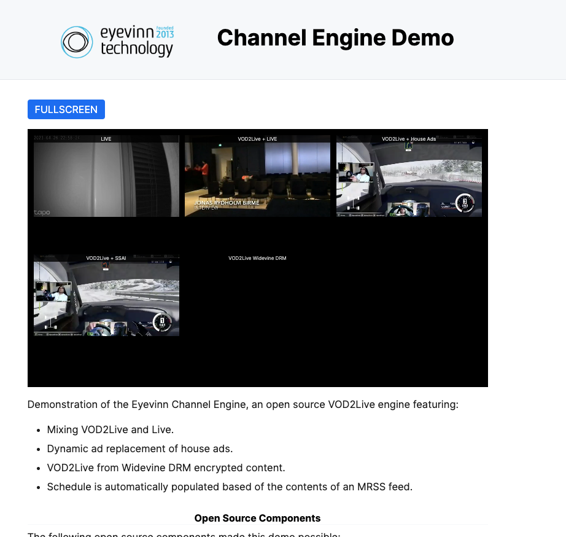

<h1 align="center">
  Eyevinn Channel Engine
</h1>
<div align="center">
  Open Source FAST Channel Engine library based on VOD2Live technology
  <br/>
  <br/>
  :book: <b><a href="https://vod2live.docs.eyevinn.technology">Read the documentation</a></b> :eyes:
</div>

<div align="center">
  <br/>

  [](https://www.npmjs.com/package/eyevinn-channel-engine)
  [](https://github.com/Eyevinn/channel-engine/releases)
  [](LICENSE)
  [](https://github.com/eyevinn/channel-engine/issues?q=is%3Aissue+is%3Aopen+label%3A%22help+wanted%22)
  [](https://github.com/eyevinn)
  [](http://slack.streamingtech.se)


</div>
<div align="center">

[](https://app.osaas.io/browse/channel-engine)

</div>

Eyevinn Channel Engine is a core component library for creating FAST channels based on VOD2Live technology. Combine this vod2live technology component with your business and scheduling logic to build your very own and unique FAST channel engine. 

Please see the [Documentation](https://vod2live.docs.eyevinn.technology) for introductory tutorials and how to get started building your own FAST channel engine.



## Features

- Produce 24/7 HLS live channels based on already transcoded HLS VODs
- Produce a personalized 24/7 HLS live channel unique for each viewer
- Mix VOD2Live channel with a "real" live HLS stream
- Develop adapters to plugin with custom scheduling endpoints
- High Availability with Redis Cache as shared state store
- Support for WebVTT subtitles
- Support for DRM encrypted HLS VODs (in beta)
- And much more!

## System Requirements

Supported Node.js Versions

| Version | Supported | 
| ------- | --------- |
| 14.x    | Yes       |
| 16.x    | Yes       |
| 18.x    | Yes       |

## Supported Source Formats

| HLS Format | Muxed | Demuxed | Mix w. Live | Subtitles | DRM |
| ---------- | ----- | ------- | ----------- | --------- | --- |
| HLS + TS   | Yes   | Yes     | Yes*        | Yes       | No  |
| HLS + CMAF | No    | Yes     | TBD         | Yes       | TBD |

*\* not supported with demuxed sources*

## High Availability Support

[High availability support](https://vod2live.docs.eyevinn.technology/usage-guide.html#high-availability) is from v3 general available in the Channel Engine and it uses Redis as the shared storage. This allows you to run a replicaset behind a round-robin load balancer. Supported Redis Engine versions:

| Version | Supported | 
| ------- | --------- |
| 5.x     | Yes       |
| 6.x     | Yes       |
| 7.x    | No        |

## Usage (Docker)

Follow [this tutorial](https://vod2live.docs.eyevinn.technology/getting-started.html) to get started building your own FAST channel engine.

You can also use prebuilt [Eyevinn FAST Engine Docker Container](https://github.com/Eyevinn/docker-fast) based on this library. To try it out you can start an instance with 50 demo channels by running this command:

```
docker run -d -p 8000:8000 -p 8001:8001 \
  -e DEMO_NUM_CHANNELS=50 \
  eyevinntechnology/fast-engine
```

Open the URL http://localhost:8001/ in your browser for a multiview of all 50 channels, and to playback one of the 50 channels point your HLS video player to the URL: http://localhost:8000/channels/<N>/master.m3u8 where <N> is a number between 1 and 50.

## Usage (Eyevinn Open Source Cloud)

Available as an open web service in [Eyevinn Open Source Cloud (OSC)](https://www.osaas.io).

1. Sign up for an [OSC account](https://www.osaas.io)
2. Get the personal access token in the web console (Settings/API)
3. Store it in the environment variable `OSC_ACCESS_TOKEN` in your shell

```bash
% export OSC_ACCESS_TOKEN=<personal-access-token>
```

4. Launch a channel called `guide` using the OSC command line tool.

```bash
% npx -y @osaas/cli create channel-engine guide \
  -o type=Loop \
  -o url=https://lab.cdn.eyevinn.technology/osc/osc-reel/a4e1156e-f872-455f-9f1f-be73b5effba8/index.m3u8
Instance created:
{
  id: 'eyevinnlab-guide',
  name: 'guide',
  type: 'Loop',
  url: 'https://lab.cdn.eyevinn.technology/osc/osc-reel/a4e1156e-f872-455f-9f1f-be73b5effba8/index.m3u8',
  playback: 'https://eyevinnlab.ce.prod.osaas.io/channels/guide/master.m3u8'
}  
```

This will create a linear channel by looping the Open Source Cloud demo reel video. Channel is available for playback on URL https://eyevinnlab.ce.prod.osaas.io/channels/guide/master.m3u8 in this case.

## Migration

### Upgrading from 3.4.x to >= 4.0.0

Support for HLS-CMAF and handling audio and video segments of different durations was added to v4
and this means that it is not possible to mix muxed TS with demuxed CMAF.

### Upgrading from 3.3.x to >= 3.4.x

A breaking change was introduced in v3.4.0 when Typescript types were introduced. The library no longer exports a default. This means that you need to change `const ChannelEngine = require('eyevinn-channel-engine')` to `const { ChannelEngine } = require('eyevinn-channel-engine')`;

## Contributing

Read [CONTRIBUTING](CONTRIBUTING.md) first and then follow the instructions below to get started with the devolpment environment.

### Development

Install the dependencies:

```
npm install
```

Build the app:

```
npm run build
```

To start the reference implementation in `examples/default.ts` run:

```
npm start
```

For full debug mode you set the environment variable `DEBUG`.

```
DEBUG=* npm start
```

or if you want be more specific for example:

```
DEBUG=engine-* npm start
```

In addition there other reference implemetations that can be used:
- `examples/demux.ts` : example with demuxed audio
- `examples/livemix.ts` : example with live mimxing
- `examples/multicodec.ts` : example with multicodec
- `examples/drm.ts` : example with DRM
- `examples/autocreate.ts` : example to auto create channel on demand
- `examples/truncate.ts` : example when trimming start and end of a VOD

### Source linking hls-vodtolive library

It is not uncommon that you need to test an local branch of the hls-vodtolive library and in order to do that you can use `npm link`.

1. Go to the directory where you have the source code for the hls-vodtolive library and run `npm link`
2. Then go to the channel engine source code directory and run `npm link @eyevinn/hls-vodtolive`

To restore and use the npm published version run the following in the channel engine source code directory:

```
npm uninstall --no-save @eyevinn/hls-vodtolive
npm install
```

## Support

Join our [community on Slack](http://slack.streamingtech.se) where you can post any questions regarding any of our open source projects. Eyevinn's consulting business can also offer you:

- Further development of this component
- Customization and integration of this component into your platform
- Support and maintenance agreement

## About Eyevinn Technology

[Eyevinn Technology](https://www.eyevinntechnology.se) is an independent consultant firm specialized in video and streaming. Independent in a way that we are not commercially tied to any platform or technology vendor. As our way to innovate and push the industry forward we develop proof-of-concepts and tools. The things we learn and the code we write we share with the industry in [blogs](https://dev.to/video) and by open sourcing the code we have written.

Want to know more about Eyevinn and how it is to work here. Contact us at work@eyevinn.se!

