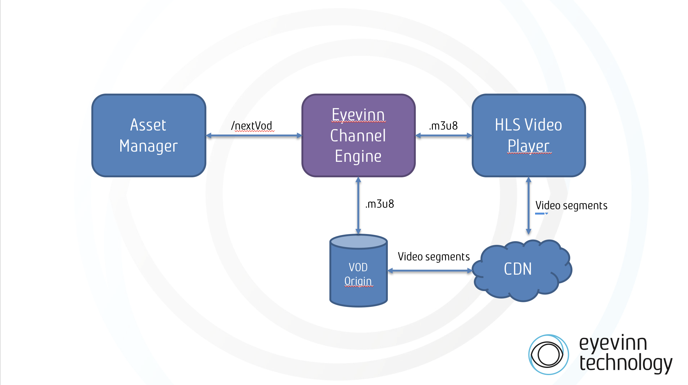
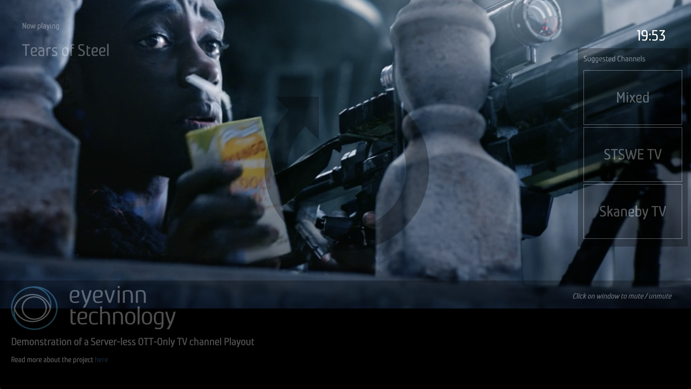

The Eyevinn Channel Engine is a "video server" for OTT-only TV channels.

## Background
We asked ourselves the question: If we would startup a TV channel for distribution only over the Internet (OTT) today, how would a technical solution for this look like?

A TV channel is an editorial based packaging of content designed for the laid-back viewer. Though the on-demand watching is becoming a big portion of TV consumption today there are still room for a service directed to a viewer that doesn’t know exactly what to watch, which is why we believe consumption of TV channels still has a place in this landscape. But instead of having a number of fixed and pre-programmed TV channels each viewer will have their own personalized TV channel. However, that doesn’t mean that we would have one encoder per viewer and instead we found a more efficient and scalable way of achieving this.

The general concept that we used is that we take a content repository with already encoded video on demand (VOD) packages and dynamically “stitch” these VOD packages together into a “live” stream. For the player and viewer it looks and feels like a “live” TV channel but it is actually created on-the-fly by concatenating the already prepared VOD packages.

The component that dynamically stitch these VOD packages together is what we call the Eyevinn Channel Engine.



## Features

Eyevinn Channel Engine currently includes the following features:

* Apple HLS live stream from Apple HLS VOD
* Eventstream for video application to poll metadata of what is currently inserted into the live stream
* Basic server-side ad insertion

## Demo

A live demonstration of this concept is available at https://tv.eyevinn.technology



## Installation

The Eyevinn Channel Engine is available as a Docker image. To run it locally on your computer (assuming you already have Docker Engine installed) just run the following command:

```
$ docker run -e ASSETMGR_URI=https://assetmgr.example.com -p 8000:8000 eyevinntechnology/channelengine:latest
```

Asset Manager API is where you decide what next content the Channel Engine should stitch by implementing a REST resource called `/nextVod/CHANNEL` returning a JSON object in the following format:

```
{
  "id": ASSETID,
  "uri": URI-TO-VOD-HLS,
  "title": TITLE
}
```

The HLS live stream is then available at `http://localhost:8000/live/master.m3u8`.

## Documentation

For full documentation on the expected API interfaces and find the reference documentation [here](reference.md).

## License

We are making the Eyevinn Channel Engine available as Open Source under the Apache License version 2.0. If you are using this component in your platform and in production we would be really happy if you would drop us a note at info@eyevinn.se. It's just always fun to know!

## Contributing

Pull requests are welcome and we prefer to develop in a topic branch and avoid develop directly against master.

## References

* [Server-less OTT-Only Playout](https://medium.com/@eyevinntechnology/server-less-ott-only-playout-bc5a7f2e6d04)
* [Enabling Video Ads in our Server-less OTT-only TV Channel Playout](https://medium.com/@eyevinntechnology/enabling-video-ads-in-our-server-less-ott-only-tv-channel-playout-81a5e0458f17)